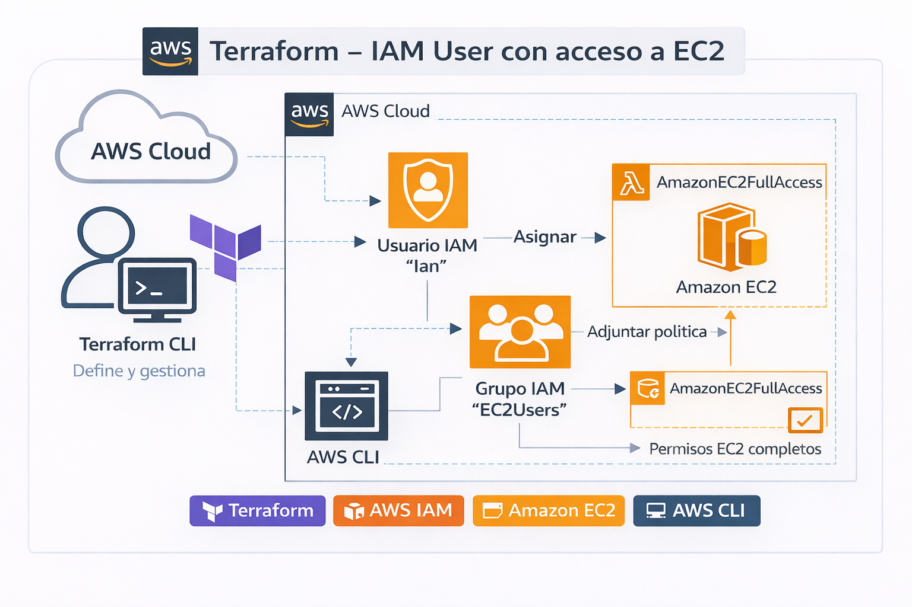
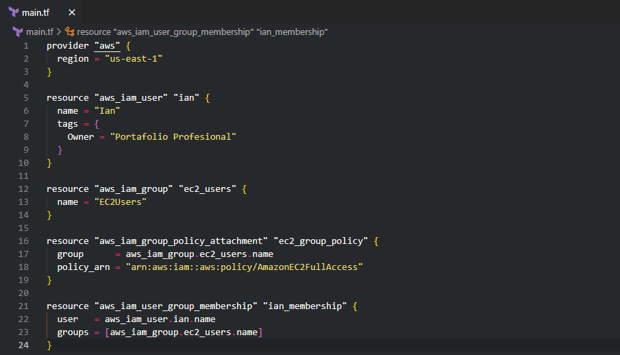
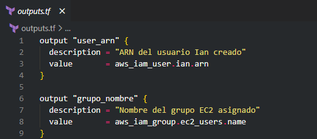
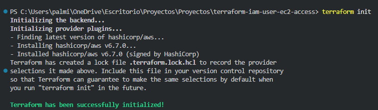
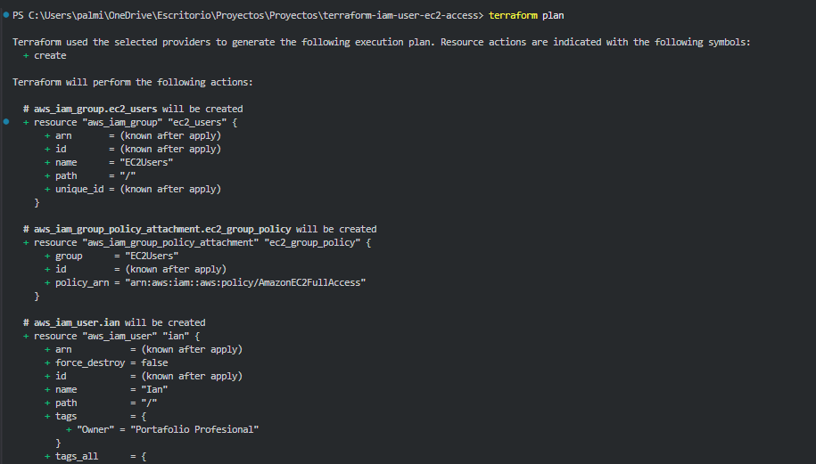
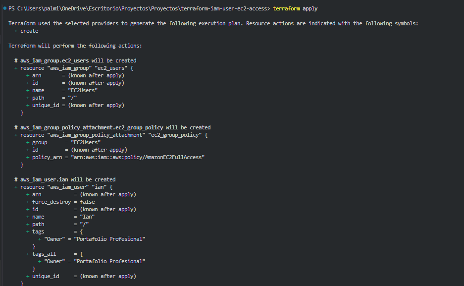
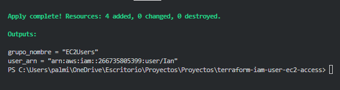
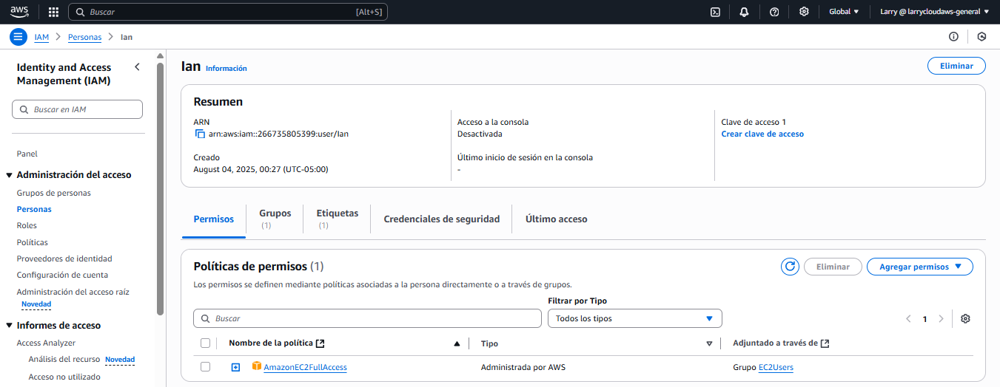
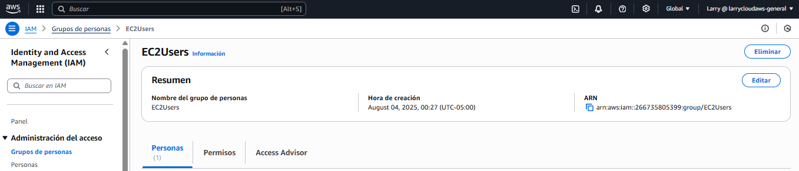
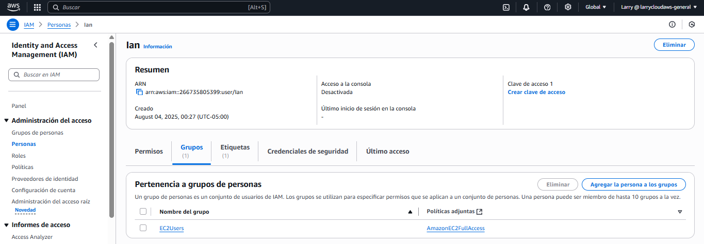

📘 Available languages:
- 🇬🇧 English (this document)
- 🇪🇸 Versión en Español (README.md)

# 🚀 Terraform – IAM User with Access to Amazon EC2

This project demonstrates how to **create and manage AWS IAM users using Terraform**, applying the **Infrastructure as Code (IaC)** approach and best practices for **cloud governance and access control**.

It is part of my **Cloud & DevOps professional portfolio**, oriented toward **Junior Cloud Engineer / DevOps Engineer** roles, and showcases real AWS execution with verifiable evidence.

---

## 🎯 Project Objectives

- Create an **IAM user** named `Ian`
- Create an **IAM group** named `EC2Users`
- Attach the managed policy `AmazonEC2FullAccess`
- Associate the user with the group to inherit permissions
- Manage the entire process using **Terraform**

---

## 🧱 Project Architecture



The architecture represents the permission flow:
- Terraform defines and manages the resources
- IAM controls access through users and groups
- The IAM group centralizes EC2 permissions
- The user inherits permissions in a secure and scalable way

---

## 🛠️ Technologies Used

- Terraform
- AWS IAM
- Amazon EC2
- AWS CLI
- Visual Studio Code

---

## 📁 Project Structure

```text
terraform-iam-user-ec2-access/
├── main.tf
├── outputs.tf
├── README.md
├── README_EN.md
├── architecture/
│   └── terraform_iam_ec2.png
└── screenshots/
    └── *.png


```
---

## 🔍 Technical Explanation

### `main.tf`

- Defines the AWS provider and region.
- Creates the IAM user **Ian**.
- Creates the IAM group **EC2Users**.
- Attaches the **AmazonEC2FullAccess** policy.
- Associates the user with the IAM group.

This approach allows **centralized permission management**, easier **auditing**, and **scalable access control** without modifying individual users.

---

### `outputs.tf`

Exposes key information after execution:

- **ARN** of the created IAM user.
- **Name of the assigned IAM group**.

This enables **direct verification from the terminal output**, without relying on the AWS web console.

---

## 🚀 Project Execution

```bash
terraform init     # Initialize the project
terraform plan     # Preview planned changes
terraform apply    # Provision resources in AWS

```
---

## 🧪 AWS Verification

After execution, the following is validated:

- The **Ian** IAM user was successfully created.
- The user belongs to the **EC2Users** group.
- The group has the **AmazonEC2FullAccess** policy attached.

---

## 📸 Project Evidence (VS Code + AWS Console)

The following screenshots document the **complete step-by-step execution** of the project, from the code in **Visual Studio Code**, through **Terraform execution**, to the **final verification in the AWS Console**.

---

---

### 🖥️ Visual Studio Code & Terraform

1. **Project structure in VS Code**  
   

2. **`main.tf` – IAM resource definitions**  
   

3. **`outputs.tf` – Terraform outputs**  
   

4. **Project initialization with `terraform init`**  
   

5. **Execution planning with `terraform plan`**  
   

6. **Infrastructure deployment with `terraform apply`**  
   

7. **Final outputs after execution**  
   

---

### ☁️ AWS Console (IAM)

8. **IAM user `Ian` successfully created**  
   

9. **IAM group `EC2Users` with attached policy**  
   

10. **User `Ian` associated with `EC2Users` group**  
    

---


These screenshots confirm that:

- Resources were **successfully created using Terraform**.
- The **user → group → policy** relationship works correctly.
- The project was deployed and validated in a **real AWS environment**.

---

## 🧠 Skills Demonstrated

- Infrastructure as Code (IaC) with Terraform.
- Identity and Access Management using AWS IAM.
- Cloud permission automation.
- Governance best practices.
- Clear and professional technical documentation.

---

## ⚠️ Security Considerations

> The **AmazonEC2FullAccess** policy is used for **educational and demonstration purposes**.  
> In production environments, the **principle of least privilege** should be applied using custom policies.

---

## ✨ Future Improvements

- Create custom IAM policies (`aws_iam_policy_document`).
- Modularize the Terraform code.
- Use variables (`variables.tf`).
- Environment separation (**dev / prod**).
- Use IAM roles and temporary credentials (**STS**).

---

## 👨‍💻 Author

**Larry Andrés Rondan Manrique**  
🌐 Portfolio: https://devopscloud.click  
🐙 GitHub: https://github.com/larrycloud  
💼 LinkedIn: https://www.linkedin.com/in/larry-cloud-devops/
