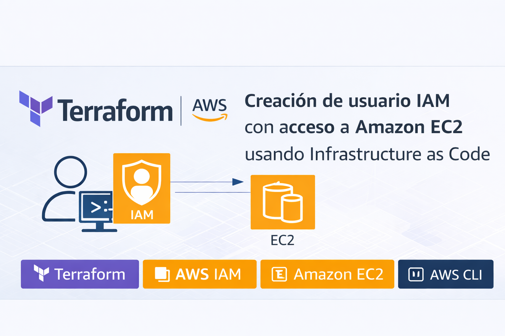

📘 **Available languages**
- 🇪🇸 [Versión en Español](README.md)
- 🇬🇧 [English Version](README_EN.md)

# 🚀 Terraform – IAM User con acceso a Amazon EC2

Este proyecto demuestra cómo **crear y gestionar usuarios IAM en AWS utilizando Terraform**, aplicando el enfoque de **Infraestructura como Código (IaC)** y buenas prácticas de **gobernanza y control de accesos en la nube**.

Forma parte de mi **portafolio profesional Cloud & DevOps**, orientado a posiciones **Junior Cloud Engineer / DevOps Engineer**, y muestra ejecución real en AWS con evidencias verificables.

---

## 🎯 Objetivo del proyecto

- Crear un **usuario IAM** llamado `Ian`
- Crear un **grupo IAM** llamado `EC2Users`
- Asignar la política administrada `AmazonEC2FullAccess`
- Asociar el usuario al grupo para heredar permisos
- Gestionar todo el proceso mediante **Terraform**

---

## 🧱 Arquitectura del proyecto


La arquitectura refleja el flujo de permisos:
- Terraform define y gestiona los recursos
- IAM controla el acceso mediante usuarios y grupos
- El grupo IAM centraliza los permisos EC2
- El usuario hereda permisos de forma segura y escalable

---

## 🛠️ Tecnologías utilizadas

- Terraform
- AWS IAM
- Amazon EC2
- AWS CLI
- Visual Studio Code

---

## 📁 Estructura del proyecto

```text
terraform-iam-user-ec2-access/
├── main.tf
├── outputs.tf
├── README.md
├── README_EN.md
├── architecture/
│   └── terraform_iam_ec2.png
└── screenshots/
    └── *.png

```
---

## 🔍 Explicación técnica

### `main.tf`

- Define el proveedor AWS y la región.
- Crea el usuario IAM **Ian**.
- Crea el grupo IAM **EC2Users**.
- Asigna la política **AmazonEC2FullAccess**.
- Vincula el usuario al grupo IAM.

Este enfoque permite **centralizar permisos**, facilitar **auditorías** y **escalar accesos** sin modificar usuarios individualmente.

---

### `outputs.tf`

Expone información clave tras la ejecución:

- **ARN** del usuario IAM creado.
- **Nombre del grupo IAM** asignado.

Esto permite **verificar resultados directamente desde la consola**, sin depender de la interfaz web de AWS.

---

## 🚀 Ejecución del proyecto

```bash
terraform init     # Inicializa el proyecto
terraform plan     # Muestra los cambios a aplicar
terraform apply    # Crea los recursos en AWS

```

---

## 🧪 Verificación en AWS

Tras la ejecución se valida que:

- El usuario **Ian** fue creado correctamente.
- El usuario pertenece al grupo **EC2Users**.
- El grupo tiene asignada la política **AmazonEC2FullAccess**.

---

## 📸 Evidencias visuales del proyecto (VS Code + AWS Console)

Las siguientes capturas documentan **paso a paso** la ejecución completa del proyecto, desde el código en **Visual Studio Code**, la ejecución de **Terraform**, hasta la **verificación final en la consola de AWS**.

---

### 🖥️ Visual Studio Code & Terraform

1. **Estructura del proyecto en VS Code**  
   

2. **Archivo `main.tf` – definición de recursos IAM**  
   

3. **Archivo `outputs.tf` – salidas del proyecto**  
   

4. **Inicialización del proyecto con `terraform init`**  
   

5. **Planificación de cambios con `terraform plan`**  
   

6. **Aplicación de la infraestructura con `terraform apply`**  
   

7. **Resultados finales y outputs generados**  
   

---

### ☁️ Consola de AWS (IAM)

8. **Usuario IAM `Ian` creado correctamente**  
   

9. **Grupo IAM `EC2Users` con política adjunta**  
   

10. **Usuario `Ian` asociado al grupo `EC2Users`**  
    

---

Estas evidencias confirman que:

- Los recursos fueron creados **exitosamente con Terraform**.
- La relación **usuario → grupo → política** funciona correctamente.
- El proyecto fue ejecutado y validado en un **entorno real de AWS**.

---

## 🧠 Habilidades demostradas

- Infraestructura como Código (IaC) con Terraform.
- Gestión de identidades y accesos con AWS IAM.
- Automatización de permisos en la nube.
- Buenas prácticas de gobernanza.
- Documentación técnica clara y profesional.

---

## ⚠️ Consideraciones de seguridad

> La política **AmazonEC2FullAccess** se utiliza con fines **educativos y demostrativos**.  
> En entornos productivos se recomienda aplicar el **principio de menor privilegio**, utilizando políticas personalizadas.

---

## ✨ Próximas mejoras

- Crear políticas IAM personalizadas (`aws_iam_policy_document`).
- Modularizar el código Terraform.
- Uso de variables (`variables.tf`).
- Separación por entornos (**dev / prod**).
- Uso de roles IAM y credenciales temporales (**STS**).

---

## 👨‍💻 Autor

**Larry Andrés Rondan Manrique**  
🌐 Portafolio: https://devopscloud.click  
🐙 GitHub: https://github.com/larrycloud  
💼 LinkedIn: https://www.linkedin.com/in/larry-cloud-devops/
